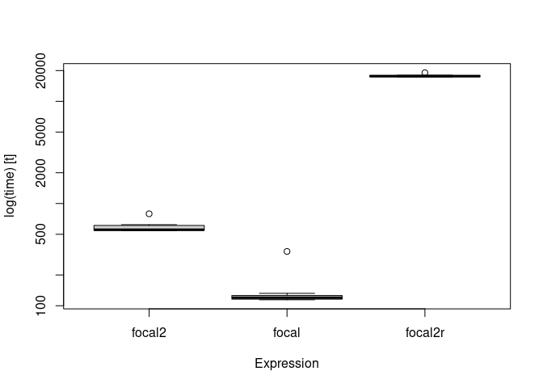

<!-- README.md is generated from README.Rmd. Please edit that file -->

[](https://cran.r-project.org/package=starsExtra)
[](https://cran.r-project.org/package=starsExtra)

starsExtra
==========

R package `starsExtra` provides several miscellaneous functions for
working with `stars` objects, mainly single-band rasters. Currently
includes functions for:

-   Focal filtering
-   Detrending of Digital Elevation Models
-   Calculating flow length
-   Calculating the Convergence Index
-   Calculating topographic aspect

Installation
------------

CRAN version:

``` r
install.packages("starsExtra")
```

GitHub version:

``` r
install.packages("remotes")
remotes::install_github("michaeldorman/starsExtra")
```

Usage
-----

Once installed, the library can be loaded as follows.

``` r
library(starsExtra)
#> Loading required package: sf
#> Linking to GEOS 3.8.0, GDAL 3.0.4, PROJ 6.3.1
#> Loading required package: stars
#> Loading required package: abind
```

Documentation
-------------

The complete documentation can be found at
<https://michaeldorman.github.io/starsExtra/>.

Example
-------

The following code applied a 15\*15 mean focal filter on a 533\*627
`stars` Digital Elevation Model (DEM):

``` r
data(carmel)
carmel_mean15 = focal2(
  x = carmel,             # Input 'stars' raster
  w = matrix(1, 15, 15),  # Weights
  fun = "mean",           # Aggregation function
  na.rm = TRUE,           # 'NA' in neighborhood are removed
  mask = TRUE             # Areas that were 'NA' in 'x' are masked from result
)
```

The calculation takes: 0.5631919 secs.

The original DEM and the filtered DEM can be combined and plotted with
the following expressions:

``` r
r = c(carmel, carmel_mean15, along = 3)
r = st_set_dimensions(r, 3, values = c("input", "15*15 mean filter"))
plot(r, breaks = "equal", col = terrain.colors(10), key.pos = 4)
```


Timing
------

The following code section compares the calculation time of `focal2` in
the above example with `raster::focal` (both using C/C++) and the
reference method `starsExtra:::focal2r` (using R code only).

``` r
library(microbenchmark)
library(starsExtra)
library(raster)
#> Loading required package: sp

data(carmel)
carmelr = as(carmel, "Raster")

res = microbenchmark(
  focal2 = focal2(carmel, w = matrix(1, 15, 15), fun = "mean", na.rm = FALSE), 
  focal = focal(carmelr, w = matrix(1, 15, 15), fun = mean, na.rm = FALSE),
  focal2r = starsExtra:::focal2r(carmel, k = 15, mean),
  times = 10
)
res
#> Unit: milliseconds
#>     expr        min         lq       mean     median         uq        max
#>   focal2   490.8400   497.2334   507.1330   500.9711   505.5926   543.1901
#>    focal   115.7206   119.2707   153.4027   121.3225   124.4334   413.7475
#>  focal2r 14946.2629 15031.5734 15172.0134 15111.5967 15311.7349 15582.1324
#>  neval
#>     10
#>     10
#>     10
```

``` r
boxplot(res)
```


