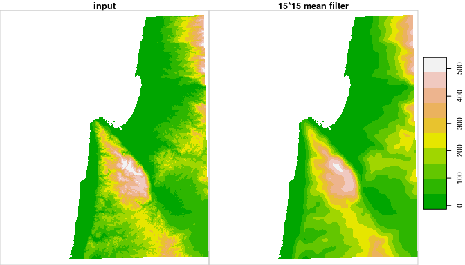

<!-- README.md is generated from README.Rmd. Please edit that file -->
[](https://cran.r-project.org/package=starsExtra)
[](https://cran.r-project.org/package=starsExtra)

starsExtra
==========

R package `starsExtra` provides several miscellaneous functions for
working with `stars` objects, mainly single-band rasters. Currently
includes functions for:

-   Focal filtering,
-   Detrending of Digital Elevation Models
-   Calculating flow length

Installation
------------

GitHub version:

``` r
install.packages("remotes")
remotes::install_github("michaeldorman/starsExtra")
```

Usage
-----

Once installed, the library can be loaded as follows.

``` r
library(starsExtra)
#> Loading required package: sf
#> Linking to GEOS 3.6.2, GDAL 2.2.3, PROJ 5.2.0
#> Loading required package: stars
#> Loading required package: abind
```

Example
-------

The following code applied a 15*15 mean focal filter on a 533*627
`stars` Digital Elevation Model (DEM):

``` r
data(carmel)
carmel1 = focal2(carmel, matrix(1, 15, 15), "mean")
```

``` r
data(carmel)
start = Sys.time()
carmel1 = focal2(carmel, matrix(1, 15, 15), "mean")
end = Sys.time()
d = end - start
```

The calculation takes: 0.2245615 secs.

The original DEM and the filtered DEM can be combined and plotted with
the following expressions:

``` r
r = c(carmel, round(carmel1, 1), along = 3)
r = st_set_dimensions(r, 3, values = c("input", "15*15 mean filter"))
plot(r, breaks = "equal", col = terrain.colors(10), key.pos = 4)
```


