# Introduction

## Package `starsExtra`

R package `starsExtra` provides several miscellaneous functions for
working with `stars` objects, mainly single-band rasters. Currently
includes functions for:

- Focal filtering
- Detrending of Digital Elevation Models
- Calculating flow length
- Calculating the Convergence Index
- Calculating topographic slope
- Calculating topographic aspect

## Installation

CRAN version:

``` r
install.packages("starsExtra")
```

GitHub version:

``` r
install.packages("remotes")
remotes::install_github("michaeldorman/starsExtra")
```

## Usage

Once installed, the library can be loaded as follows:

``` r
library(starsExtra)
#> Loading required package: sf
#> Linking to GEOS 3.14.1, GDAL 3.12.2, PROJ 9.8.1; sf_use_s2() is TRUE
#> Loading required package: stars
#> Loading required package: abind
#> Registered S3 method overwritten by 'stars':
#>   method                  from
#>   st_interpolate_aw.stars sf
```

## Examples

### Focal filter: aggregation functions

``` r
data(dem)
dem_mean3 = focal2(dem, matrix(1, 3, 3), "mean", na.rm = TRUE)
dem_sum3 = focal2(dem, matrix(1, 3, 3), "sum", na.rm = TRUE)
dem_min3 = focal2(dem, matrix(1, 3, 3), "min", na.rm = TRUE)
dem_max3 = focal2(dem, matrix(1, 3, 3), "max", na.rm = TRUE)
```

``` r
plot(dem, main = "input", text_values = TRUE, breaks = "equal", col = terrain.colors(10))
plot(dem, col = rep(NA, 3), key.pos = NULL, main = "")
plot(round(dem_mean3, 1), main = "mean (k=3)", text_values = TRUE, breaks = "equal", col = terrain.colors(10))
plot(dem_sum3, main = "sum (k=3)", text_values = TRUE, breaks = "equal", col = terrain.colors(10))
plot(dem_min3, main = "min (k=3)", text_values = TRUE, breaks = "equal", col = terrain.colors(10))
plot(dem_max3, main = "max (k=3)", text_values = TRUE, breaks = "equal", col = terrain.colors(10))
```

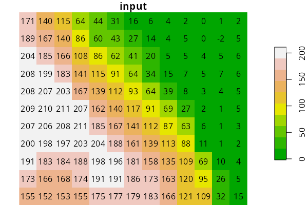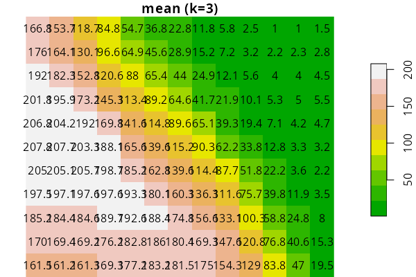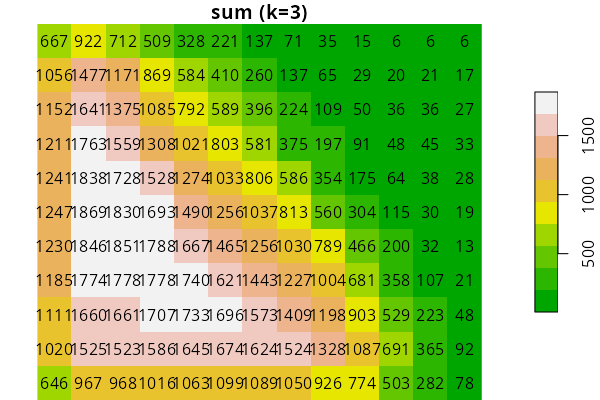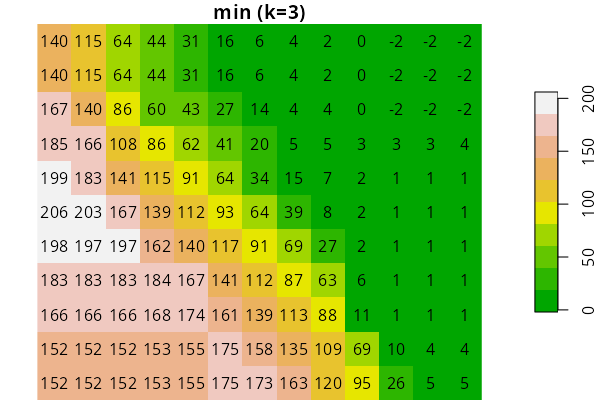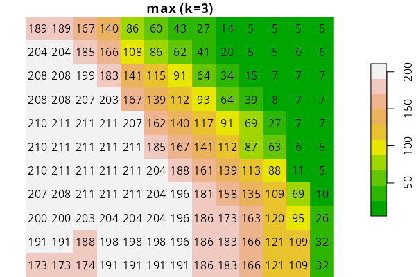

### Focal filter: window size

``` r
data(carmel)
carmel_mean9 = focal2(carmel, matrix(1, 9, 9), "mean", na.rm = TRUE, mask = TRUE)
carmel_mean27 = focal2(carmel, matrix(1, 27, 27), "mean", na.rm = TRUE, mask = TRUE)
```

``` r
plot(carmel, main = "input", breaks = "equal", col = terrain.colors(10))
plot(carmel_mean9, main = "mean (k=9)", breaks = "equal", col = terrain.colors(10))
plot(carmel_mean27, main = "mean (k=27)", breaks = "equal", col = terrain.colors(10))
```

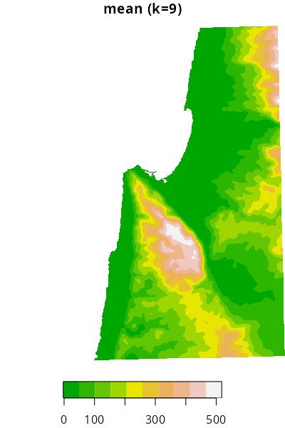

### Topographic slope

``` r
data(carmel)
carmel_slope = slope(carmel)
```

``` r
plot(carmel, breaks = "equal", col = terrain.colors(11))
plot(carmel_slope, breaks = "equal", col = hcl.colors(11, "Spectral"))
```

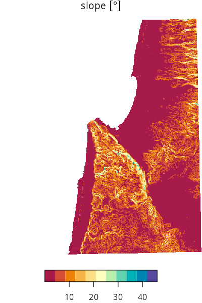

### Topographic aspect

``` r
data(carmel)
carmel_aspect = aspect(carmel)
```

``` r
plot(carmel, breaks = "equal", col = terrain.colors(11))
plot(carmel_aspect, breaks = "equal", col = hcl.colors(11, "Spectral"))
```

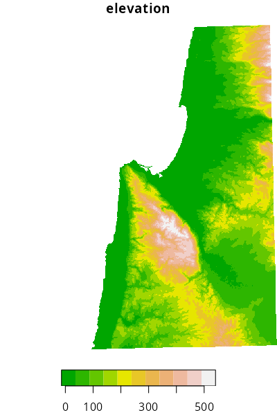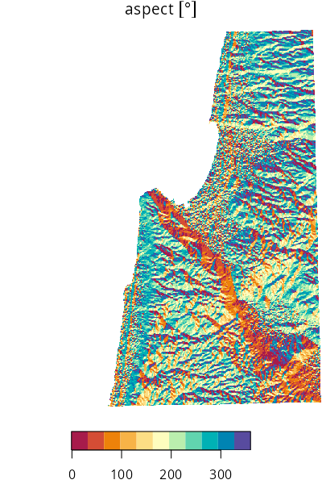

### Convergence Index

``` r
data(golan)
golan_asp = aspect(golan)
golan_ci = CI(golan_asp, k = 25)
```

``` r
plot(golan, breaks = "equal", col = terrain.colors(11))
plot(golan_asp, breaks = "equal", col = hcl.colors(11, "Spectral"))
plot(golan_ci, breaks = "equal", col = hcl.colors(11, "Spectral"))
```

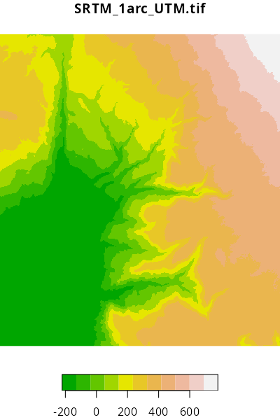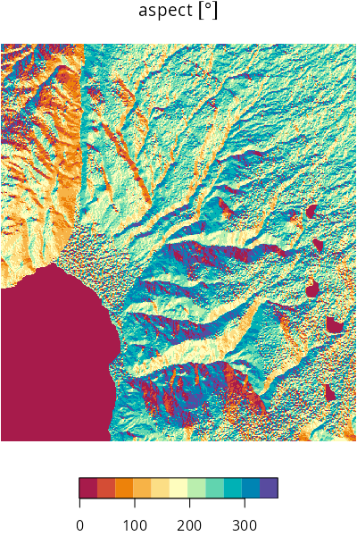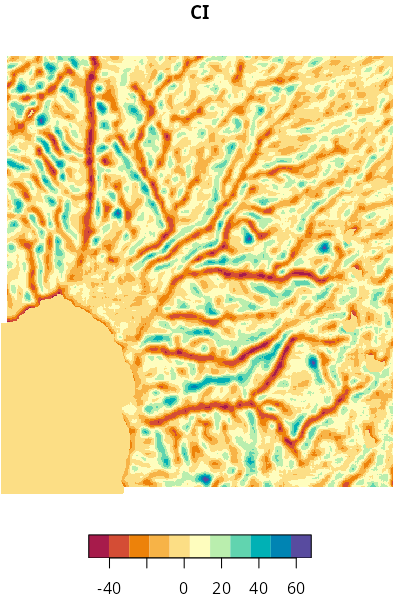
